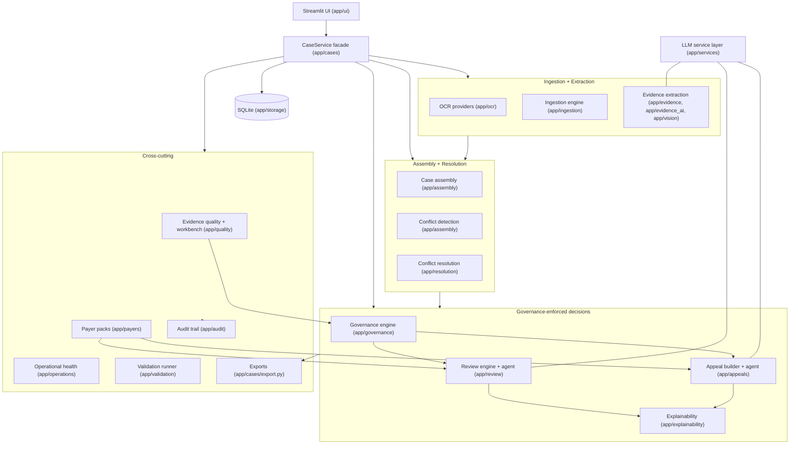
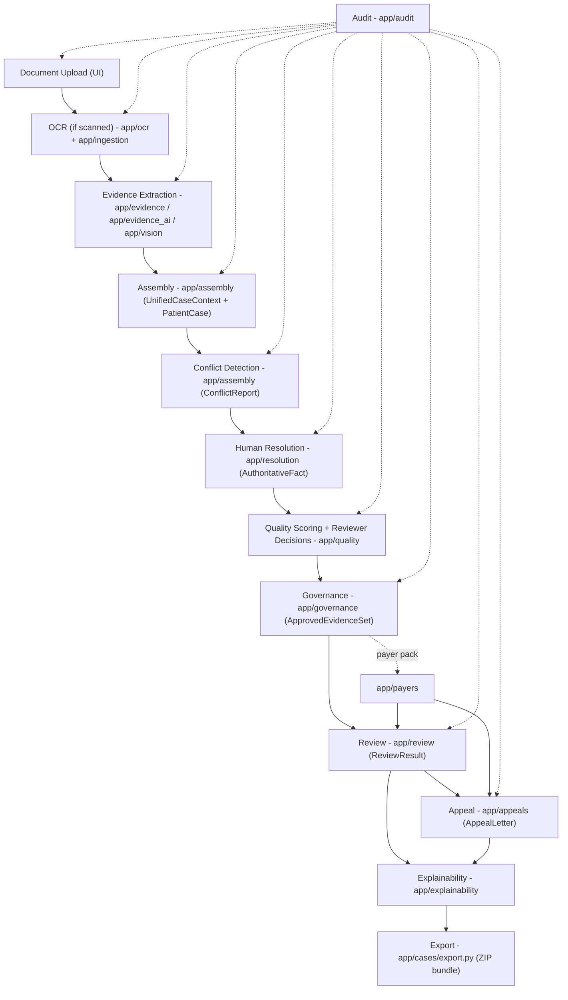
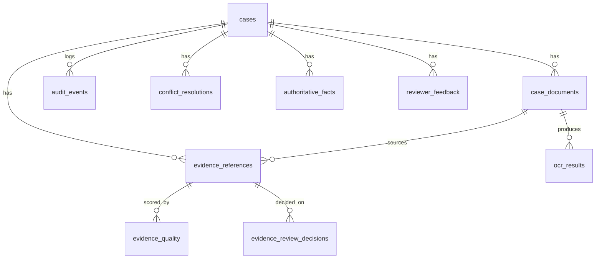
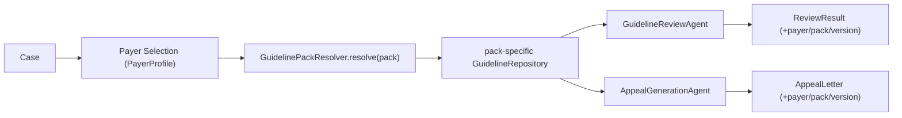

# HealthAI - Complete Architecture Reference

> Authoritative architecture document for the entire HealthAI platform.
> Documentation only - no code, schema, or behavior is changed by this file.
> Last validated against the codebase at the end of the Final Milestone
> (402 tests passing).

---

## 1. Executive Summary

### Purpose of HealthAI
HealthAI is a local, Python-based **prior-authorization document intelligence**
platform. It ingests healthcare documents (denial letters, clinical notes, lab
reports, scanned faxes), extracts structured facts with full source
traceability, reviews requests against clinical guidelines, and drafts appeal
letters - while keeping a qualified human reviewer in authority over every
decision.

### Problem being solved
Prior-authorization workflows are slow, document-heavy, and error-prone.
Reviewers must reconcile conflicting documents, check medical-necessity
criteria, and justify decisions with evidence. HealthAI accelerates this while
preserving the three properties that make the output trustworthy in a clinical
setting:

1. **Traceability** - every extracted fact links back to a source document,
   page, and verbatim quote.
2. **Reviewer authority** - human reviewers can approve/reject/flag evidence,
   and rejected evidence can never influence a governed decision.
3. **Auditability** - every significant action is recorded in an append-only
   audit trail.

### Current project status
Feature-complete for the current phase. The platform runs entirely offline by
default (deterministic local backends) and transparently upgrades to Claude when
an API key is configured. It spans 13 milestones plus a Final Milestone:
case management, OCR-aware ingestion, evidence extraction and quality scoring,
multi-document assembly with conflict detection, human conflict resolution,
governance-enforced reviews and appeals, explainability, payer-specific
guideline packs, operational health monitoring, and a validation runner.

- **Tests:** 402 passing (`python -m pytest -q`).
- **Streamlit UI:** 23 tabs (20 `render_*` tab functions wired by the dashboard).
- **Storage:** local SQLite (`data/healthai.db`), JSON-serialized artifacts.
- **Maturity:** validation-ready, not unattended-production. See `docs/production_readiness.md`.

---

## 2. System Overview

All packages are coordinated through the **`CaseService` facade**
(`app/cases/service.py`). The UI and tests talk to the facade; the facade
delegates to cohesive sub-services and owns the shared SQLite connection.

---

## 3. Milestone History

| Milestone | Goal | Major components added | Status |
| --- | --- | --- | --- |
| **M1** | Raw text extraction from uploads | `app/extraction` (`extract_text_from_bytes`, `DocumentSizeValidator`), Streamlit raw-text tab | Complete |
| **M2** | Structured extraction to a validated `PatientCase` | `app/agents/medical_extraction_agent.py` (`MedicalExtractionAgent`), `app/services` LLM layer (`LLMClient`, `LocalHeuristicClient`, `AnthropicClient`) | Complete |
| **M3** | Clinical guideline review | `app/review/engine.py` (`ClinicalReviewEngine`), `app/guidelines` (`GuidelineRepository`), `ReviewResult` | Complete |
| **M4** | Appeal-letter generation | `app/appeals` (`AppealLetterBuilder`, `AppealGenerationAgent`), `AppealLetter` | Complete |
| **M5** | Case management + audit + metrics | `app/cases` (`CaseService`, repositories, transitions), `app/audit`, `app/metrics`, `app/storage`, SQLite schema | Complete |
| **M6/7** | Multi-document assembly + evidence traceability | `app/assembly` (`CaseAssemblyEngine`), `app/evidence` (`EvidenceExtractor`, `EvidenceRepository`), `EvidenceReference`, `UnifiedCaseContext`, conflict detection + export traceability | Complete |
| **M8** | Human conflict resolution + reviewer feedback | `app/resolution` (`ConflictResolutionEngine`), `app/feedback`, `AuthoritativeFact`, `ConflictResolution`, `ReviewerFeedback` | Complete |
| **M9** | OCR + intelligent ingestion | `app/ocr` (`OCRProvider`, `MockOCRProvider`, `LocalTesseractOCRProvider`), `app/ingestion` (`DocumentIngestionEngine`, `DocumentClassifier`), `app/vision` (`VisionEvidenceExtractor`), `OCRPageResult` | Complete |
| **M10** | Claude evidence extraction + quality + workbench | `app/evidence_ai` (`ClaudeEvidenceExtractor`), `app/quality` (`EvidenceQualityEngine`, `ReviewerWorkbench`), `EvidenceQualityAssessment`, `EvidenceReviewDecision` | Complete |
| **M11** | Governance + validated evidence + analytics | `app/governance` (`ValidatedEvidenceEngine`, `GovernanceComplianceChecker`), `app/analytics` (`QualityAnalyticsEngine`), `GovernanceSettings`, `ApprovedEvidenceSet` | Complete |
| **M12** | Architecture stabilization | `CaseService` facade decomposition (sub-services + `CaseLifecycle`), UI split into `app/ui/tabs/`, cases<->analytics cycle removal, shared `app/services/json_utils.py`, `app/tests/test_architecture.py` | Complete |
| **M13** | Governance-enforced reviews/appeals + explainability | `app/explainability` (`ExplainabilityEngine`), `app/cases/explainability_service.py`, `ReviewExplanation`, `AppealExplanation`, `TraceabilityChain` | Complete |
| **Final** | Payer packs + operational hardening + production readiness | `app/payers` (`PayerRepository`, `GuidelinePackResolver`), `app/cases/payer_service.py`, `app/operations` (`OperationalHealthMonitor`), `app/validation` (`ValidationRunner`), `PayerProfile`, `OperationalHealthReport`, production-readiness docs | Complete |

Per-milestone detail lives in `docs/milestone_*.md`,
`docs/architecture_hardening.md`, and `docs/architecture_review.md`.

---

## 4. Package-by-Package Architecture

> Convention: every repository shares the one `sqlite3.Connection` owned by
> `CaseService`. Engines are pure/deterministic where possible; the facade
> records audit events so audit logic stays in one place.

### app/extraction
- **Purpose:** Turn an uploaded file (PDF/TXT) into raw text + page count; warn on oversized documents.
- **Major classes/functions:** `extract_text_from_bytes`, `extract_pages_from_bytes`, `DocumentSizeValidator`, `ValidationError`.
- **Inputs:** filename + bytes.
- **Outputs:** `ExtractedDocument` (text, page_count); `DocumentSizeReport`.
- **Dependencies:** `app/models/document.py`; PDF libs.

### app/ocr
- **Purpose:** Page-level OCR abstraction with offline + real providers.
- **Major classes:** `OCRProvider` (ABC), `MockOCRProvider` (deterministic offline stand-in), `LocalTesseractOCRProvider` (real, graceful), `OCRResultRepository`; factory `get_ocr_provider` / `describe_ocr_provider`.
- **Inputs:** image/page bytes.
- **Outputs:** `OCRPageResult` (raw_text, confidence, processing_method).
- **Dependencies:** `app/models/ocr_result.py`; optional `pytesseract`/`pillow`.

### app/ingestion
- **Purpose:** Detect document kind (text-layer vs scanned), decide whether OCR is needed, classify the document, and route to page text.
- **Major classes:** `DocumentIngestionEngine`, `DocumentClassifier`, `IngestionResult`, `IngestionKind`.
- **Inputs:** filename + bytes (+ optional category override).
- **Outputs:** `IngestionResult` (pages, ocr_results, kind, category, warnings).
- **Dependencies:** `app/ocr`, `app/extraction`, `app/models/case_document.py`.

### app/evidence
- **Purpose:** Deterministic, offline, regex-based evidence extraction + persistence; the canonical evidence store.
- **Major classes:** `EvidenceExtractor`, `EvidenceRepository`; linker helpers (`app/evidence/linker.py`).
- **Inputs:** `CaseDocument`.
- **Outputs:** `EvidenceReference` lists (canonical model).
- **Dependencies:** `app/models/evidence_reference.py`, `app/storage`.

### app/evidence_ai
- **Purpose:** Claude-backed evidence extraction with an **anti-fabrication gate** (a reference is emitted only if its quote appears verbatim in the source); falls back to the deterministic extractor.
- **Major classes:** `ClaudeEvidenceExtractor`.
- **Inputs:** `CaseDocument`, optional OCR text.
- **Outputs:** `EvidenceReference` list.
- **Dependencies:** `app/evidence`, `app/services` (LLM + `json_utils`), `app/models/evidence_reference.py`.

### app/vision
- **Purpose:** Turn OCR page results into evidence using the same contract as the text extractor (OCR-derived evidence participates in assembly/conflicts unchanged).
- **Major classes:** `VisionEvidenceExtractor`.
- **Inputs:** `CaseDocument` + `OCRPageResult` list.
- **Outputs:** `EvidenceReference` list (OCR-blended confidence).

### app/assembly
- **Purpose:** Merge multi-document evidence into one `UnifiedCaseContext`: de-duplicate facts, resolve a best value per fact, detect conflicts with severity, identify missing info, synthesize a `PatientCase`.
- **Major classes:** `CaseAssemblyEngine` (`assemble`, `synthesize_from_evidence`).
- **Inputs:** `case_id`, `CaseDocument` list (or a given evidence subset).
- **Outputs:** `UnifiedCaseContext` (evidence, resolved facts, `ConflictReport`, missing info, `PatientCase`).
- **Dependencies:** `app/evidence`, conflict/patient-case models.
- **Note:** `app/assembly/traceability.py` is part of the dead parallel lineage (see Technical Debt).

### app/review
- **Purpose:** Decide APPROVE / DENY / INSUFFICIENT_INFORMATION against the matched clinical guideline.
- **Major classes:** `ClinicalReviewEngine` (deterministic), `GuidelineReviewAgent` (Claude-backed, falls back to the engine), `ReviewAgentResult`.
- **Inputs:** `PatientCase` (+ optional document text), a `GuidelineRepository`.
- **Outputs:** `ReviewResult` (recommendation, matched/missing criteria, rationale, confidence, provenance fields).
- **Dependencies:** `app/guidelines`, `app/services`, `app/models/review_result.py`.

### app/appeals
- **Purpose:** Draft a complete appeal letter; never assert clinical facts that are not supported by the inputs.
- **Major classes:** `AppealLetterBuilder` (deterministic), `AppealGenerationAgent` (Claude-backed, falls back to builder), `AppealAgentResult`.
- **Inputs:** `PatientCase`, `ReviewResult`, optional `ClinicalGuideline`.
- **Outputs:** `AppealLetter` (structured fields + rendered `letter_text` + provenance).
- **Dependencies:** `app/guidelines`, `app/services`, `app/models/appeal_letter.py`.

### app/governance
- **Purpose:** Decide which evidence downstream review/appeal may use, and check compliance.
- **Major classes:** `ValidatedEvidenceEngine` (builds `ApprovedEvidenceSet`), `GovernanceComplianceChecker`, `GovernanceSettingsRepository`.
- **Inputs:** evidence, reviewer decisions, quality assessments, `GovernanceSettings`.
- **Outputs:** `ApprovedEvidenceSet` (included/excluded + reasons), `GovernanceComplianceReport`.
- **Dependencies:** `app/models/governance.py`, quality + decision models.

### app/explainability
- **Purpose:** Make a review/appeal auditable: which evidence was used vs. excluded, reasoning steps, governance mode, and a full lineage chain.
- **Major classes:** `ExplainabilityEngine` (`explain_review`, `explain_appeal`, `build_traceability_chain`).
- **Inputs:** review/appeal, all evidence, `ApprovedEvidenceSet`, reviewer decisions, quality map.
- **Outputs:** `ReviewExplanation`, `AppealExplanation`, `TraceabilityChain`.
- **Dependencies:** `app/models/explanation.py`, governance + evidence models. (Pure; no `app/cases` import.)

### app/payers
- **Purpose:** Make the platform configurable for different payer policies via guideline packs.
- **Major classes:** `PayerRepository` (loads `PayerProfile` from JSON), `GuidelinePackResolver` (overlays pack-specific guidelines on the base library).
- **Inputs:** payer id / pack id; `data/payers/*.json`, `data/guideline_packs/<PACK>/`.
- **Outputs:** `PayerProfile`, a pack-specific `GuidelineRepository`.
- **Dependencies:** `app/guidelines`, `app/models/payer.py`, `app/models/clinical_guideline.py`.

### app/operations
- **Purpose:** Local operational diagnostics from the audit trail (no external observability).
- **Major classes:** `OperationalHealthMonitor`.
- **Inputs:** audit events, cases, documents, optional compliance callable.
- **Outputs:** `OperationalHealthReport` (failures, fallback rate, conflict frequency, warnings).
- **Dependencies:** `app/audit`, `app/assembly`, `app/models/operational_health.py`.

### app/validation
- **Purpose:** Exercise the full pipeline against mock scenarios and assert expectations.
- **Major classes:** `ValidationRunner`, `ValidationReport`, `ValidationResult`; `load_default_scenarios`.
- **Inputs:** `validation/datasets/scenarios.json`.
- **Outputs:** `ValidationReport` (pass/fail per scenario/payer). CLI: `python -m validation.run`.
- **Dependencies:** `app/cases` facade (application-level harness).

### app/cases
- **Purpose:** The orchestration core. `CaseService` is a thin **facade** over cohesive sub-services; it owns the shared connection and all repositories as public attributes.
- **Major classes:** `CaseService` (facade), `CaseLifecycle`, sub-services: `IngestionService`, `EvidenceService`, `ReviewService`, `AppealService`, `ResolutionService`, `GovernanceService`, `AnalyticsService`, `ExportService`, `ExplainabilityService`, `PayerService`; repositories: `CaseRepository`, `CaseDocumentRepository`; `transitions.py` (`can_transition`); `export.py` (`build_export_files`, `build_export_zip`).
- **Inputs:** UI/test calls.
- **Outputs:** persisted case records, artifacts, exports.
- **Dependencies:** nearly every other package (it is the composition root).

### app/audit
- **Purpose:** Append-only audit trail.
- **Major classes:** `AuditRepository` (`log`, `record`, `for_case`, `by_type`, `all`).
- **Inputs/Outputs:** `AuditEvent` rows.
- **Dependencies:** `app/models/audit_event.py`, `app/storage`.

### app/storage
- **Purpose:** SQLite connection + idempotent schema management.
- **Major functions:** `connect`, `initialize_schema`, `DEFAULT_DB_PATH`.
- **Persistence strategy:** scalar workflow fields as columns; composed pydantic artifacts as JSON text (lossless round-trip).

### app/ui
- **Purpose:** Streamlit dashboard. `dashboard.py` is the orchestrator; `case_ui.py` is a backward-compatible re-export shim; tab modules live in `app/ui/tabs/`.
- **Major modules:** `dashboard.py`, `session.py`, `tabs/common.py` (`get_case_service`, `persist_current_case`), and per-domain tab modules (`case_tabs`, `ingestion_tabs`, `assembly_tabs`, `evidence_quality_tabs`, `resolution_tabs`, `governance_tabs`, `explainability_tabs`, `operations_tabs`).
- **Dependencies:** `app/cases` facade only (never raw storage).

### Supporting packages
- **app/agents** - `MedicalExtractionAgent` (structured extraction) + prompts + evaluation.
- **app/services** - LLM abstraction: `LLMClient` (ABC), `AnthropicClient`, `LocalHeuristicClient`, `MockClaudeClient`, `factory.get_llm_client`, shared `json_utils`.
- **app/guidelines** - `GuidelineRepository` (load + match clinical guidelines from `data/guidelines`).
- **app/quality** - `EvidenceQualityEngine`, `ReviewerWorkbench`, quality + decision repositories.
- **app/resolution** - `ConflictResolutionEngine`, resolution + authoritative-fact repositories.
- **app/feedback** - `ReviewerFeedbackRepository`, `FeedbackDataset` (exportable learning data; no ML).
- **app/analytics** - `QualityAnalyticsEngine` (org-wide quality/workflow analytics; constructor-injected repos to avoid a cycle).
- **app/metrics** - `MetricsCollector` (lightweight operational metrics).
- **app/models** - all pydantic data models (see Section 6).

---

## 5. Data Flow (end-to-end)

### Narrative
1. **Upload** - the UI sends bytes to `CaseService.ingest_document`.
2. **OCR** - `DocumentIngestionEngine` decides if OCR is needed; `OCRPageResult`s are persisted; low-confidence pages are flagged in audit.
3. **Evidence extraction** - deterministic (`EvidenceExtractor`) or Claude (`ClaudeEvidenceExtractor`, anti-fabrication gated) or OCR-based (`VisionEvidenceExtractor`).
4. **Assembly** - `CaseAssemblyEngine.assemble` de-duplicates, resolves best values, builds a `PatientCase`, and persists evidence.
5. **Conflict detection** - cross-document disagreements become a `ConflictReport` with severity.
6. **Human resolution** - reviewers resolve conflicts; choices become `AuthoritativeFact`s (rejected values preserved).
7. **Quality + decisions** - `EvidenceQualityEngine` scores; reviewers APPROVE/REJECT/FLAG evidence in the `ReviewerWorkbench`.
8. **Governance** - `ValidatedEvidenceEngine` builds the `ApprovedEvidenceSet` (draft = all; validated = approved-only, quality-gated, rejected-never).
9. **Review** - the review agent runs on a `PatientCase` synthesized from only the permitted evidence.
10. **Appeal** - the appeal agent drafts a letter from the same constrained inputs.
11. **Explainability** - `ExplainabilityEngine` records used vs. excluded evidence + reasoning + lineage.
12. **Export** - a ZIP bundle of every artifact is produced; `mark_exported` is audited.

Every numbered step records an `AuditEvent`.

---

## 6. Database Architecture

Local SQLite (`data/healthai.db`), created idempotently by
`app/storage/database.py::initialize_schema`. Schema creation is **additive and
idempotent** (`CREATE TABLE IF NOT EXISTS`), so existing databases upgrade
transparently. `PRAGMA foreign_keys = ON`; `row_factory = sqlite3.Row`.

### Tables

| Table | Purpose | Key columns |
| --- | --- | --- |
| `cases` | One row per case; workflow scalars + JSON artifacts | `case_id` (PK), `status`, `patient_case_json`, `review_result_json`, `appeal_letter_json`, `review_decisions_json` |
| `audit_events` | Append-only audit trail | `event_id` (PK), `case_id`, `event_type`, `actor`, `timestamp`, `details` |
| `case_documents` | Documents attached to a case | `document_id` (PK), `case_id`, `document_type`, `page_count`, `raw_text` |
| `evidence_references` | Canonical source-backed evidence | `evidence_id` (PK), `case_id`, `source_document_id`, `page_number`, `quoted_text`, `normalized_fact`, `fact_type`, `confidence_score` |
| `conflict_resolutions` | Human conflict resolutions (append-only) | `resolution_id` (PK), `case_id`, `conflict_id`, `chosen_value`, `rejected_values_json`, `reviewer_name` |
| `authoritative_facts` | Resolved value per (case, fact_type) | `fact_id` (PK), `UNIQUE(case_id, fact_type)`, `resolution_source` (SYSTEM/HUMAN) |
| `reviewer_feedback` | Structured reviewer feedback | `feedback_id` (PK), `case_id`, `target_type`, `feedback`, `comments` |
| `ocr_results` | Per-page OCR provenance | `ocr_id` (PK), `document_id`, `page_number`, `confidence`, `processing_method` |
| `evidence_quality` | Quality assessment per evidence | `assessment_id` (PK), `evidence_id`, four sub-scores + `overall_score`, `issues_json` |
| `evidence_review_decisions` | Reviewer APPROVE/REJECT/FLAG (append-only) | `decision_id` (PK), `evidence_id`, `decision`, `reviewer` |
| `governance_settings` | Single global policy row | `settings_id` (PK), `validated_evidence_mode`, `allow_unreviewed_evidence`, `minimum_quality_score`, two gate flags |

### Relationships (logical)

Relationships are by id columns at the application layer (no SQL foreign-key
constraints between case-scoped tables), keeping schema additive and migrations
unnecessary.

### Indexes
Indexes back the common lookups: `audit_events(case_id)`, `cases(status)`,
`case_documents(case_id)`, `evidence_references(case_id)` and
`(source_document_id)`, `conflict_resolutions(case_id)`,
`authoritative_facts(case_id)`, `reviewer_feedback(case_id)`,
`ocr_results(case_id)` and `(document_id)`, `evidence_quality(case_id)` and
`(evidence_id)`, `evidence_review_decisions(case_id)` and `(evidence_id)`.

### Persistence strategy
- **Scalars as columns** (for querying/filtering), **composed pydantic artifacts
  as JSON text** (lossless `model_dump_json` / `model_validate_json`).
- This is why optional model fields (e.g. payer provenance, explanation fields)
  can be added **without a schema migration**.
- Append-only tables (audit, evidence decisions, conflict resolutions) are never
  edited - they are the traceability/audit backbone.

---

## 7. Evidence Architecture

- **`EvidenceReference`** (`app/models/evidence_reference.py`) - the canonical
  evidence model. Ties a `normalized_fact` ("field: value") to its
  `source_document_id`, `page_number`, `section_label`, verbatim `quoted_text`,
  `fact_type`, and `confidence_score`. Provides `citation()`.
- **Quality scoring** - `EvidenceQualityEngine` scores completeness, relevance,
  consistency, and traceability into an `overall_score`; `is_weak` flags
  low-quality evidence. Stored as `EvidenceQualityAssessment`.
- **Reviewer decisions** - `ReviewerWorkbench` records `EvidenceReviewDecision`
  (APPROVE/REJECT/FLAG), append-only and audited. Latest-decision-per-evidence
  wins.
- **Governance filtering** - `ValidatedEvidenceEngine` produces an
  `ApprovedEvidenceSet`: in validated mode, REJECTED is always excluded,
  sub-threshold quality is excluded, and (optionally) unreviewed evidence is
  excluded.
- **Explainability** - `ExplainabilityEngine` records, per decision, which
  evidence was used vs. excluded (with reasons) and the reasoning steps.
- **Traceability** - `TraceabilityChain` links every evidence id to source
  document, page, reviewer decision, and quality score, flagged
  included/excluded. Exports include `traceability_chain.json` and
  `traceability_report.md`.

**Anti-fabrication:** the Claude evidence extractor emits a reference only if its
quote appears verbatim in the source; the deterministic extractor never invents
values. No fabricated evidence can enter the system.

---

## 8. Governance Architecture

- **Draft mode** (default) - all evidence is permitted downstream (preserves
  pre-governance behavior).
- **Validated mode** - downstream review/appeal use only the governance-filtered
  set.
- **`ApprovedEvidenceSet`** - the result of applying `GovernanceSettings` to a
  case's evidence: `included_ids` + `excluded` (each with a reason) + a settings
  snapshot.
- **`GovernanceSettings`** - `validated_evidence_mode`,
  `allow_unreviewed_evidence`, `minimum_quality_score`,
  `require_conflict_resolution`, `require_human_review_before_export`. Stored as
  a single global row.
- **Compliance checks** - `GovernanceComplianceChecker` produces a
  `GovernanceComplianceReport` detecting: appeals with weak evidence,
  unresolved conflicts, exports without human review, low-quality evidence usage.
- **Reviewer authority** - the overriding rule: REJECTED evidence is excluded in
  validated mode **regardless of any other setting**. Governance-enforced
  reviews/appeals synthesize the `PatientCase` from only the permitted evidence,
  so the agents never even see rejected evidence. This is proven by tests in
  `test_governance_explainability.py`.

---

## 9. Payer Architecture

- **Guideline packs** - a pack is the base library (`data/guidelines/`) plus
  optional overrides in `data/guideline_packs/<PACK>/`. Supported packs:
  DEFAULT, AETNA, UNITEDHEALTHCARE, CIGNA, HUMANA, MOCK_PAYER (all simplified
  **mock** policies; no proprietary content).
- **Overrides** - a pack file overrides a base guideline that shares the same
  `guideline_id`; everything else is inherited. This keeps packs small.
- **Pack resolution** - `GuidelinePackResolver.resolve(pack_id)` returns a
  `GuidelineRepository` (cached) overlaying pack files on the base library;
  unknown/empty pack ids fall back to DEFAULT.
- **Review integration** - `PayerService.review_with_payer` binds a
  `GuidelineReviewAgent` to the resolved pack and runs the governed pipeline;
  the result records `payer_id`, `guideline_pack`, `guideline_version`.
- **Appeal integration** - `PayerService.appeal_with_payer` binds both the
  review and appeal agents to the pack and stamps the same provenance on the
  `AppealLetter`.
- **Profiles** - `PayerProfile` (`payer_id`, `payer_name`, `guideline_pack`,
  `version`, `effective_date`, `status`) loaded from `data/payers/*.json`; a
  built-in DEFAULT always exists.

---

## 10. Operational Monitoring

- **Operational health** - `OperationalHealthMonitor.collect()` returns an
  `OperationalHealthReport`: OCR/extraction/review/appeal failures, Claude
  fallback count + rate, governance violations, conflict frequency, plus
  human-readable warnings and a coarse `is_healthy` flag. Failure detection
  scans stable audit-detail markers, so it is decoupled from agent internals.
- **Analytics** - `QualityAnalyticsEngine.collect()` returns `QualityAnalytics`:
  evidence approval/rejection/flag rates, average quality, weak-evidence rate,
  conflict rate, review turnaround, appeal-generation success rate.
- **Validation runner** - `ValidationRunner.run()` exercises the full pipeline
  per scenario/payer and checks expectations; `python -m validation.run` is
  CI-gateable (non-zero exit on failure).
- **Metrics** - `MetricsCollector.collect()` returns `OperationalMetrics`:
  documents processed, appeals generated, human reviews, approval/rejection/
  fallback rates, average processing time, status breakdown.

All of the above are read-only, computed on demand from local SQLite; there is
no background collection and no external observability platform.

---

## 11. Security Assumptions

### Current assumptions
- Trusted, single-tenant, local environment.
- No built-in authentication, authorization, or transport security; if exposed
  beyond localhost, must sit behind an authenticating reverse proxy / VPN.
- Secrets (`ANTHROPIC_API_KEY`) read from the environment; never written to the
  DB or exports.
- External content (LLM output, parsed documents) is treated as untrusted data
  and never executed.

### Known limitations
- SQLite data is unencrypted at rest (rely on host disk encryption).
- Single-node, low-concurrency design.

### Human-review requirements
- Every generated review/appeal is **decision-support only** and must be
  reviewed and signed off by a qualified human before external use.
- Governance can enforce human review before export and conflict resolution.

### PHI considerations
- Documents are expected to contain PHI; all processing is local **except** the
  text sent to Anthropic when the Claude backend is explicitly enabled
  (operator owns the BAA/compliance). With the local backend, no data leaves the
  host.
- Sample/validation data is synthetic. Exports may contain PHI - treat ZIPs as
  sensitive.

See `docs/production_readiness.md` for the full checklist.

---

## 12. Technical Debt

- **Dead parallel evidence lineage** - `app/cases/assembly_service.py` ->
  `app/cases/evidence_repository.py` -> `app/models/evidence.py` (a second
  `EvidenceReference` + duplicate conflict models), plus
  `app/assembly/traceability.py`. This cluster has **zero live importers**; the
  canonical lineage is `app/models/evidence_reference.py` +
  `app/evidence/repository.py`. An architecture test
  (`test_architecture.py`) guards that the legacy module stays unreachable from
  the app entry points. Removing it requires file deletions (deferred; needs
  approval).
- **Mock OCR limitations** - without Tesseract installed, `MockOCRProvider`
  decodes text fixtures rather than performing real image OCR. Real OCR needs
  `pytesseract` + `pillow` + the Tesseract binary.
- **Mock Claude limitations** - default offline runs use `LocalHeuristicClient`
  / `MockClaudeClient`. These are deterministic stand-ins; real Claude behavior
  (quality, latency, cost) has not been validated end-to-end.
- **SQLite limitations** - single-file, single-writer; not suited to concurrent
  multi-user or high-throughput workloads.
- **Single-user assumptions** - no auth, no per-user state, no concurrency
  control; the UI assumes one operator.

---

## 13. Future Roadmap

1. **Real Claude validation** - enable the Anthropic backend and validate
   extraction/review/appeal quality, latency, and cost against a labeled set.
2. **Real OCR validation** - install Tesseract and validate scanned-document
   accuracy + confidence calibration.
3. **Payer-specific policy ingestion** - replace mock packs with a vetted
   ingestion pipeline for real (licensed) payer policies.
4. **Authentication** - add user authN/Z and session management.
5. **Multi-user support** - concurrency control and per-user workspaces.
6. **Cloud deployment** - migrate from SQLite to a server-backed database;
   containerize; add secrets management.
7. **HIPAA hardening** - encryption at rest, BAAs, access logging, data-retention
   policies, and a formal security review.

---

_This document is the authoritative architecture reference. Package and class
names were verified against the codebase; the milestone history matches the
`docs/milestone_*.md` set. For onboarding, read alongside `docs/HANDOVER.md`._
