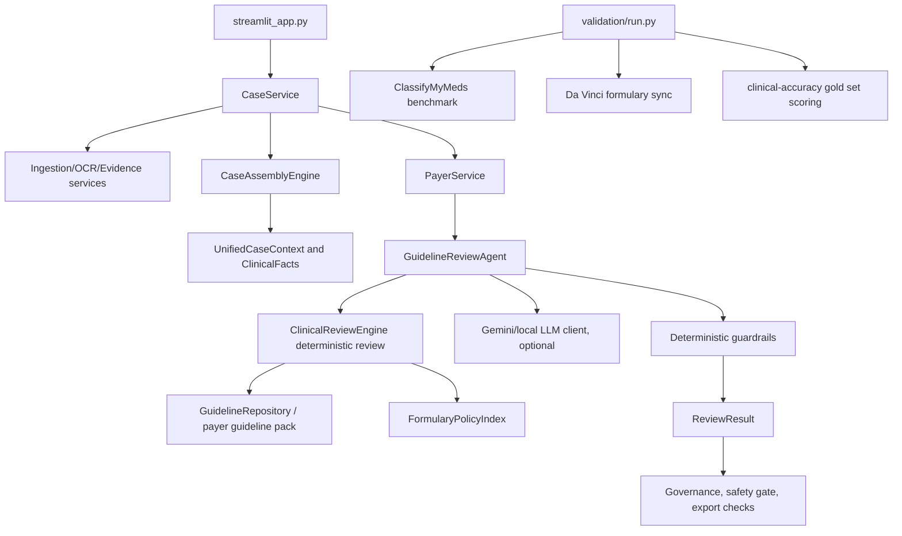

# HealthAI External Agent Handover

Last updated: 2026-06-18

This handover is for a new Codex agent coming into the project cold. The most important context is that this is a clinical prior authorization review system where the safe behavior is not "always decide"; the safe target is very high accuracy on the auto-decided slice, with abstention to human review when evidence is stale, conflicted, incomplete, or ambiguous.

## Repo And Runtime

- Project root: `C:\HealthAI - Copy`
- Main UI: `streamlit_app.py`
- Alternate Gemini chat app: `vertex_gemini_chat_app.py`
- Validation CLI: `validation/run.py`
- Main local database: `data\healthai.db`
- Python runtime used by the user: `.venv\Scripts\python.exe`

Useful local deterministic setup:

```powershell
$env:HEALTHAI_LLM_BACKEND = "local"
.venv\Scripts\python.exe -m pytest app\tests\test_review_medspacy_polarity.py app\tests\test_review_agent.py app\tests\test_gold_policy_confidence.py -q
```

Useful Gemini setup:

```powershell
$env:GOOGLE_APPLICATION_CREDENTIALS = "C:\Users\jakes\Downloads\skilled-loader-468413-j6-50ec35997585.json"
$env:HEALTHAI_LLM_BACKEND = "gemini"
$env:HEALTHAI_GEMINI_MODEL = "gemini-3.5-flash"
$env:GOOGLE_CLOUD_PROJECT = "skilled-loader-468413-j6"
$env:GOOGLE_CLOUD_LOCATION = "global"
$env:GOOGLE_GENAI_USE_VERTEXAI = "true"
$env:HEALTHAI_STRUCTURED_EXTRACTION_BACKEND = "gemini"
$env:HEALTHAI_CLINICAL_REASONING_BACKEND = "gemini"
$env:HEALTHAI_APPEAL_DRAFTING_BACKEND = "gemini"
$env:HEALTHAI_APPEAL_VERIFICATION_BACKEND = "gemini"
.venv\Scripts\python.exe -m streamlit run streamlit_app.py
```

When stale UI results appear, the cause is often not Python bytecode. It may be the SQLite case database, Streamlit session state, Streamlit cache, or an already-running Streamlit process. For a clean local restart:

```powershell
Get-Process streamlit,python -ErrorAction SilentlyContinue | Stop-Process -Force
Remove-Item data\healthai.db,data\healthai.db-wal,data\healthai.db-shm,data\healthai.db-journal -Force -ErrorAction SilentlyContinue
Get-ChildItem -Recurse -Directory -Force -Include "__pycache__",".pytest_cache" | Remove-Item -Recurse -Force
.venv\Scripts\python.exe -m streamlit cache clear
.venv\Scripts\python.exe -m streamlit run streamlit_app.py
```

## Graphify Architecture Snapshot

Graphify artifacts already exist under `graphify-out\`. The current architecture summary is based on `graphify-out\GRAPH_REPORT.md`.

Graphify corpus stats:

- Corpus: 485 files, about 22,652,775 words.
- Graph: 8,461 nodes, 23,944 edges, 484 communities.
- Import cycles: none detected by Graphify.
- Core hubs called out by Graphify include `PatientCase`, `ReviewResult`, `CaseService`, and `CaseAssemblyEngine`.
- Relevant communities:
  - Community 3: `PatientCase`, `ReviewResult`, `GuidelineReviewAgent`, clinical review package.
  - Community 16/24/29: `CaseService` orchestration, selected-case workflows, conflict resolution tests.
  - Community 36: `GuidelineReviewAgent`, governed review, appeal/export safety.
  - Community 60: `ClinicalReviewEngine`, rule-based clinical guideline review.
  - Community 96: agent map: deterministic engines, `GuidelineReviewAgent`, evidence extraction, OCR providers.
  - Communities 328-340: root cause diagnostic findings for review failures.
  - Communities 351-393: clinical accuracy, false approve rate, auto-decision slices, confidence calibration.

Practical architecture map:



## Main Entry Points To Inspect

- `app\review\engine.py`: deterministic clinical review. Current hot area for temporality, TB polarity, step therapy, specialist/provider role, policy/formulary rules, and final recommendation.
- `app\review\review_agent.py`: AI review wrapper and deterministic safety guardrails. If AI disagrees with deterministic safety logic, this file decides whether to override, merge details, or route to human review.
- `app\review\clinical_nlp.py`: clinical signal extraction and polarity helpers, including TB and step therapy states.
- `app\evidence\extractor.py`: evidence extraction from text into normalized evidence/facts.
- `app\assembly\engine.py`: multi-document assembly, evidence healing, conflict marking, governed evidence behavior.
- `app\governance\safety.py`: export and safety gates.
- `app\policies\formulary.py`: normalized Da Vinci formulary policy index.
- `app\cases\service.py` and `app\cases\payer_service.py`: workflow orchestration and payer-specific review.
- `app\validation\clinical_accuracy.py`: auto-decision accuracy, confidence calibration, false-approve and traceability metrics.
- `validation\run.py`: single CLI for scenarios, ClassifyMyMeds benchmark, Da Vinci formulary sync, and clinical-accuracy scoring.

## The Critical Failed Case just one example, there are many cases that produces wrong recommendations 

The user repeatedly tested this case:

```text
*** HISTORICAL ARCHIVE REPORT - GENERATED FROM LEGACY EMERGE SYSTEM ***
ORIGINAL RECORD DATE: 14-Aug-2021
PATIENT: Harvey Dent
MEMBER ID: TWO-FACE-99

ARCHIVE SUMMARY: Patient was diagnosed in 2021 with Severe Plaque Psoriasis. He completed a 16-week trial of Methotrexate tablets which failed to clear skin lesions. A PPD skin test was performed on 01-Aug-2021 and read as Negative. Recommendation at that time was to begin Humira 40mg SC.

CURRENT CORRESPONDENCE (DATE: 10-May-2026): Please use the attached 2021 historical records to approve the current 2026 prior authorization request for Humira 40mg SC every 2 weeks.

SUBMITTING PROVIDER: Dr. G. Gotham, MD (Dermatology Clinic Coordinator)
```

Old failed behavior:

- Local deterministic engine returned `APPROVE`.
- It marked all criteria matched:
  - diagnosis
  - step therapy
  - negative TB screen
  - specialist
- Missing criteria were empty.
- Gemini/LLM review returned `DENY`.
- Gemini matched step therapy and TB, but said diagnosis and specialist were missing.

Correct expected behavior:

- Recommendation: `INSUFFICIENT_INFORMATION`
- Matched criteria:
  - covered diagnosis / approved indication
  - step therapy met/failed
- Missing or unknown criteria:
  - current, valid negative TB screening. The 2021 PPD negative is stale for a 2026 request.
  - current active clinical evaluation / current specialist involvement. `Dermatology Clinic Coordinator` is not specialist-prescriber evidence.

Current verified regression:

- `app\tests\test_review_medspacy_polarity.py::test_historical_archive_psoriasis_case_does_not_auto_approve_current_humira`
- Expected now:
  - `Recommendation.INSUFFICIENT_INFORMATION`
  - diagnosis `MET`
  - step therapy `MET`
  - TB `UNKNOWN` with stale historical archive note
  - specialist `UNKNOWN` with coordinator note

## Current Fixes Already In The Code

These fixes appear to be implemented and covered by focused tests. Do not remove them while chasing new failures.

1. TB polarity safety:
   - Bare `TB.`, `Discussed TB risk.`, and `Tuberculosis.` are `unknown`, not positive.
   - Explicit positive TB still denies.
   - `Patient has no history of TB` does not create a contraindication.

2. Step therapy wording:
   - Non-methotrexate step therapy should not be rewritten as `"methotrexate failure"`.
   - Azathioprine failure should preserve azathioprine wording.
   - Methotrexate failure still satisfies methotrexate-specific step therapy.

3. Provider/specialist handling:
   - Explicit PCP/internal medicine/family physician evidence can mark specialist criterion `NOT_MET`.
   - Generic `MD`, `DO`, `physician`, `NP`, and `PA` without specialty context should stay `UNKNOWN`.
   - Coordinator titles such as `Dermatology Clinic Coordinator` should not satisfy specialist criteria.
   - Real rheumatologist/dermatologist/gastroenterologist cues should still satisfy relevant specialist criteria.

4. Governed evidence assembly:
   - Governed assembly mode should not heal new requested-service evidence from incidental drug mentions when `allow_document_text_healing=False`.
   - Validated evidence mode must consume only supplied governed evidence.

5. AI guardrails:
   - Deterministic `DENY` can override AI `APPROVE`.
   - Missing deterministic `CriterionEvaluation` entries are copied/synthesized into AI output.
   - Deterministic `INSUFFICIENT_INFORMATION` can override AI when required evidence is unknown, but this is narrowed so AI can still select a guideline when deterministic matching missed it.

6. Export safety:
   - Unresolved conflicts from `review_result.safety_gate["unresolved_conflicts"]` should block export without a human decision.

7. Formulary policy wiring:
   - `FormularyPolicyIndex` exists in `app\policies\formulary.py`.
   - `CaseService`, `PayerService`, and `GuidelineReviewAgent` accept a formulary policy index and payer ID.
   - `ClinicalReviewEngine` can query payer-specific formulary rules.

8. Accuracy/calibration framework:
   - `app\validation\clinical_accuracy.py` implements auto-decision scoring, calibration buckets, false-approve tracking, traceability checks, and safety-slice release gating.
   - `validation/run.py clinical-accuracy` exposes the CLI.

## Important Current Tests

Run these first after changing review logic:

```powershell
$env:HEALTHAI_LLM_BACKEND = "local"
.venv\Scripts\python.exe -m pytest app\tests\test_review_medspacy_polarity.py app\tests\test_review_agent.py app\tests\test_gold_policy_confidence.py -q
```

Most recent focused result from the current workspace: `57 passed`.

Useful validation commands:

```powershell
.venv\Scripts\python.exe -m validation.run clinical-accuracy --seed --auto-threshold 0.99 --target-accuracy 0.999 --calibration-input validation\seed_confidence_calibration.json --json
```

```powershell
.venv\Scripts\python.exe -m validation.run benchmark --dataset-dir external\classifymymeds --output validation\classifymymeds_report.json
```

```powershell
.venv\Scripts\python.exe -m validation.run formulary --source external\drug-formulary-ri\src\main\webapp\resources --output validation\davinci_formulary_catalog.json
```

Do not run commands with placeholders like `path\to\classifymymeds`; the CLI now reports this as an error and prints the correct clone-location hint.

## Historical Validation Warning

`validation\MASTER_VALIDATION_REPORT.md` is a historical artifact from 2026-06-16. It reported:

- Total cases: 10
- Passed: 1
- Failed: 9
- Local accuracy: 40.0%
- Gemini accuracy: 0.0%, but Gemini cases were unavailable/skipped, not actually run

Treat this report as a record of past failure modes, not the current score. Re-run the validation CLI after any fix before quoting current accuracy.

The seed clinical-accuracy framework has shown 100% accuracy on the auto-decided seed slice at limited coverage in prior runs. Do not market this as real 99.9% clinical accuracy. The intended claim is only: high accuracy is targeted for the auto-decided slice, while low-confidence or ambiguous cases abstain to human review.

## Remaining Work For The New Agent

1. Add first-class current-evidence/temporality rules.
   - The Harvey fix currently handles stale archive TB and coordinator specialist evidence.
   - The system still needs a more general policy concept for "current active clinical evaluation note" and "lab must be within policy lookback window."
   - Avoid hard-coding only the Harvey wording. Build reusable document-date and evidence-date handling.

2. Strengthen current TB validation.
   - Explicitly compare TB test date against request/initiation date and payer lookback requirement.
   - A stale negative TB should be `UNKNOWN` or missing evidence, not `MET`.
   - An active positive TB should remain `DENY`.

3. Strengthen specialist validation.
   - Separate a provider's name/title from a specialist consultation/prescriber role.
   - `Dermatology Clinic Coordinator` is administrative context, not specialist-prescriber evidence.
   - Generic `MD` alone remains `UNKNOWN`; explicit PCP/internal medicine can be `NOT_MET`.

4. Build a real curated adjudicated gold set.
   - The existing seed set is useful, but not enough for 95% or 99.9% claims.
   - Required fields: final label, criterion labels, evidence IDs, conflict flags, reviewer rationale, policy/version, payer, indication, drug, document dates, service/request date.
   - Keep a locked holdout set separate from calibration/training.

5. Wire formulary/policy rules deeper into payer review.
   - Da Vinci sync produces normalized formulary catalog data.
   - `FormularyPolicyIndex` is now available to live payer flows, but policy-specific requirements still need richer mapping into criteria: PA required, step therapy, quantity limit, new-start-only, indication restrictions, and recency rules.

6. Calibrate confidence from real adjudicated labels.
   - Use seed calibration only as smoke-test scaffolding.
   - Real calibration should learn caps by recommendation, payer, indication, drug, evidence slice, and document type.
   - Auto-approval should require traceability, no unresolved conflicts, no unknown safety-critical criteria, and calibrated confidence above threshold.

7. Keep deterministic review as the safety floor.
   - LLM should help normalize/explain, not overrule deterministic safety gates.
   - If deterministic and AI disagree on safety-critical criteria, route to human review or apply deterministic guardrail.

8. Improve stale-result hygiene in UI.
   - Make it obvious in Streamlit which backend, model, DB path, code version, and review timestamp produced the displayed recommendation.
   - Add a "clear active case/session" control if not already present.
   - User has repeatedly seen old failed cases after restarts, so stale state is a real workflow risk.

## What Not To Break

- Do not change public model schemas such as `ReviewResult`, `CriterionEvaluation`, `CaseRecord`, or governance models unless tests prove an existing field cannot carry the required data.
- Preserve the distinction between `DENY` and `INSUFFICIENT_INFORMATION`.
  - `DENY` needs explicit contraindication, non-covered indication, or explicit unmet requirement.
  - `INSUFFICIENT_INFORMATION` is correct when evidence is stale, missing, ambiguous, or unknown.
- Do not synthesize clinical facts that are not in governed evidence when governed evidence mode is strict.
- Do not treat policy text or educational text as patient-specific clinical evidence.
- Do not convert generic medical titles into specialist evidence.

## Suggested First Task For Incoming Agent

Start by re-running the focused tests and the Harvey Dent case through both local and Gemini paths. Confirm the current baseline:

- local clinical review: `INSUFFICIENT_INFORMATION`
- Gemini clinical review after deterministic guardrails: `INSUFFICIENT_INFORMATION`
- matched: diagnosis and step therapy
- missing/unknown: current valid TB screen and current specialist/current clinical evaluation evidence

Then implement a general temporality layer for evidence recency rather than adding more one-off phrase checks.
